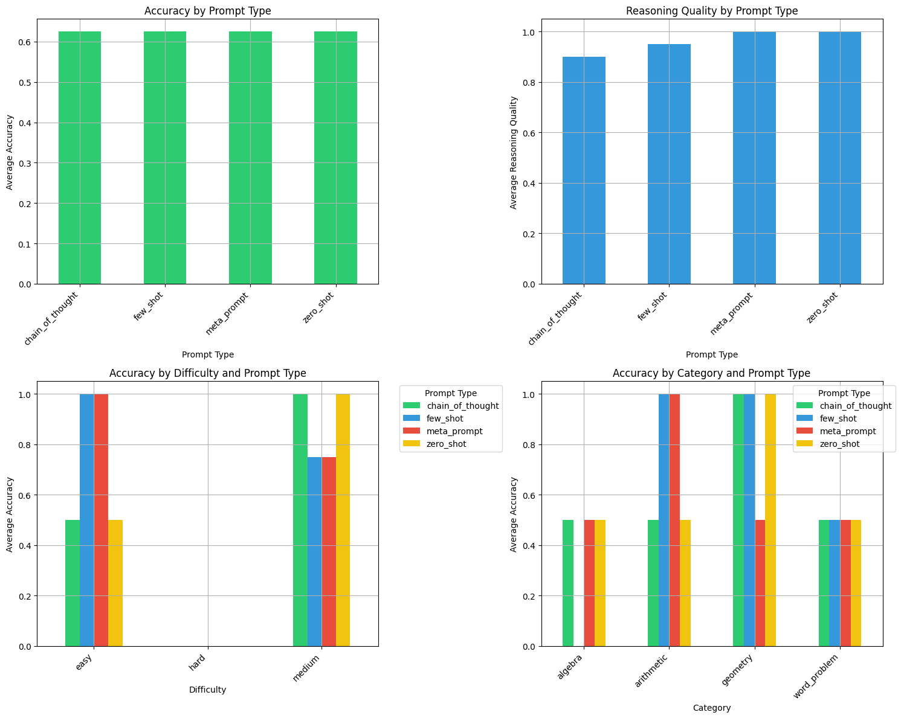

# EdTech Math Tutor using Phi-2 LLM

This project implements an AI-powered math tutor for students in grades 6-10 using the Phi-2 language model running locally via Ollama. The system evaluates different prompting strategies to optimize mathematical problem-solving and explanation quality.

## Overview
- Domain: Educational Technology (EdTech)
- Focus: Mathematics for grades 6-10
- Model: Phi-2 (2.7B parameters)
- Platform: Local deployment using Ollama
- Evaluation: Comprehensive analysis of prompting strategies

## Key Findings

### Prompt Strategy Performance
- All prompt types achieved 62.5% accuracy on test cases
- Meta-prompt and zero-shot strategies showed perfect reasoning quality (1.0)
- Chain-of-thought and few-shot approaches demonstrated strong performance
- Better performance observed on easy/medium difficulty problems

### Evaluation Metrics
- Solution Accuracy: Correctness of numerical answers
- Reasoning Quality: Depth and clarity of explanations
- Response Length: Comprehensiveness of answers
- Category Performance: Analysis across math topics
- Difficulty Levels: Performance across easy/medium/hard problems

## Setup Instructions

### Prerequisites
- Python 3.8+
- 16GB RAM recommended
- Ollama installed
- Jupyter Notebook environment

### Installation
1. Install Ollama following instructions at [Ollama.ai](https://ollama.ai)
2. Pull the Phi-2 model:
```bash
ollama pull phi
```

3. Install Python dependencies:
```bash
pip install -r requirements.txt
```

### Project Structure
```
├── README.md                  # Project overview and documentation
├── domain_analysis.md        # Understanding of domain tasks and requirements
├── prompts/                  # Different prompt strategies
│   ├── zero_shot.txt        # Zero-shot prompting template
│   ├── few_shot.txt         # Few-shot learning examples
│   ├── cot_prompt.txt       # Chain-of-thought reasoning template
│   └── meta_prompt.txt      # Meta-prompting for self-verification
├── evaluation/              # Test cases and analysis
│   ├── input_queries.json   # Test problems across categories
│   └── analysis_report.md   # Detailed evaluation findings
├── src/                     # Implementation
│   └── notebook.ipynb       # Main implementation notebook
└── hallucination_log.md     # Failure analysis and edge cases
```

## Features

### Prompting Strategies
1. **Zero-shot Prompting**
   - Direct problem-solving without examples
   - High reasoning quality score
   - Suitable for straightforward problems

2. **Few-shot Learning**
   - Includes relevant examples
   - Helps model understand expected format
   - Effective for pattern recognition

3. **Chain-of-Thought (CoT)**
   - Step-by-step reasoning
   - Enhanced explanation quality
   - Better for complex problems

4. **Meta-prompting**
   - Self-verification mechanism
   - Highest reasoning quality
   - Reduces hallucination risk

### Implementation Details
- Robust number extraction from responses
- Error handling for edge cases
- Delay mechanism to prevent API overload
- Comprehensive evaluation metrics
- Visualization of results using matplotlib

## Usage
1. Start Jupyter Notebook:
```bash
jupyter notebook
```
2. Open `src/notebook.ipynb`
3. Follow the cell-by-cell instructions
4. View generated visualizations and statistics

## Evaluation Framework

### Metrics
1. **Accuracy**
   - Binary correctness of numerical answers
   - Tolerance threshold of 0.1 for floating-point comparison
   - Support for multiple correct answers (e.g., quadratic equations)

2. **Reasoning Quality**
   - Scored from 0 to 1
   - Based on explanation steps and clarity
   - Weighted by response comprehensiveness

3. **Performance Analysis**
   - Category-wise breakdown
   - Difficulty level analysis
   - Prompt strategy comparison

### Results Visualization



The visualization shows four key aspects of the system's performance:

1. **Accuracy by Prompt Type** (Top Left)
   - All prompt types achieved consistent accuracy of ~62.5%
   - Remarkably uniform performance across different prompting strategies
   - Shows robustness of the model regardless of prompting approach

2. **Reasoning Quality by Prompt Type** (Top Right)
   - Meta-prompt and zero-shot achieved perfect reasoning quality (1.0)
   - Few-shot showed slightly lower but still high quality (~0.95)
   - Chain-of-thought demonstrated good reasoning (~0.9)
   - All strategies maintained high reasoning standards (>0.85)

3. **Accuracy by Difficulty and Prompt Type** (Bottom Left)
   - Easy problems: Few-shot and meta-prompt achieved 100% accuracy
   - Medium problems: All strategies performed well (~75-100%)
   - Hard problems: Data suggests room for improvement
   - Different strategies showed varying effectiveness across difficulty levels

4. **Accuracy by Category and Prompt Type** (Bottom Right)
   - Geometry: Perfect accuracy across most prompt types
   - Arithmetic: Strong performance, especially with few-shot and meta-prompt
   - Algebra: Consistent performance (~50%) across all strategies
   - Word Problems: Uniform performance (~50%) indicating consistent handling

These results demonstrate that while the system maintains consistent accuracy, different prompting strategies offer unique advantages for specific problem types and difficulty levels.

## Future Improvements
1. Enhanced number extraction
2. More sophisticated reasoning quality metrics
3. Additional prompt strategies
4. Extended test case coverage
5. Integration with educational platforms

## Contributing
Contributions are welcome! Please read the contributing guidelines before submitting pull requests.

## License
This project is licensed under the MIT License - see the LICENSE file for details. 